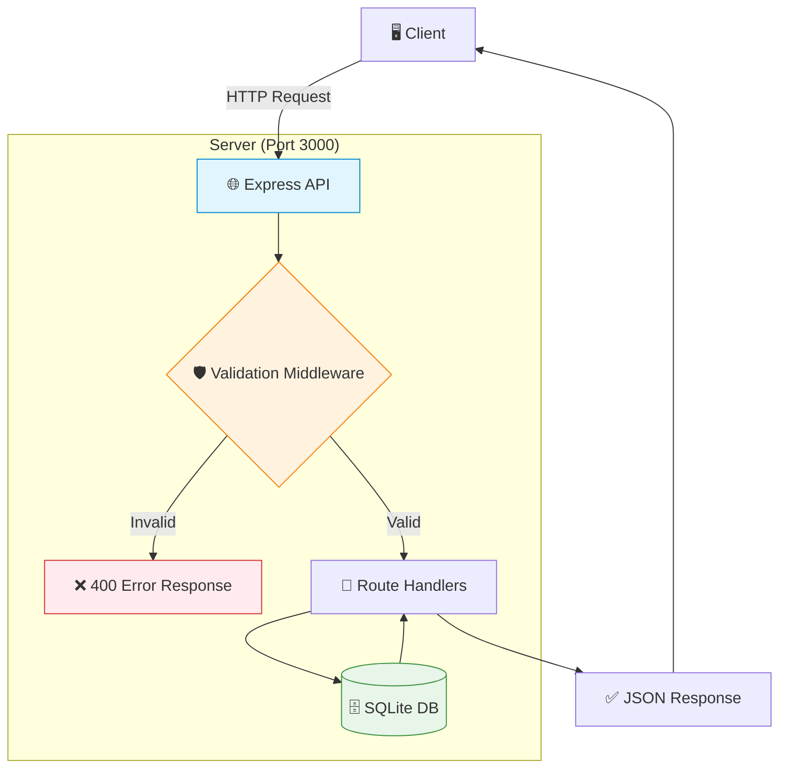
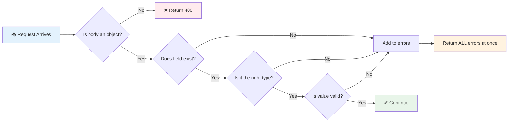
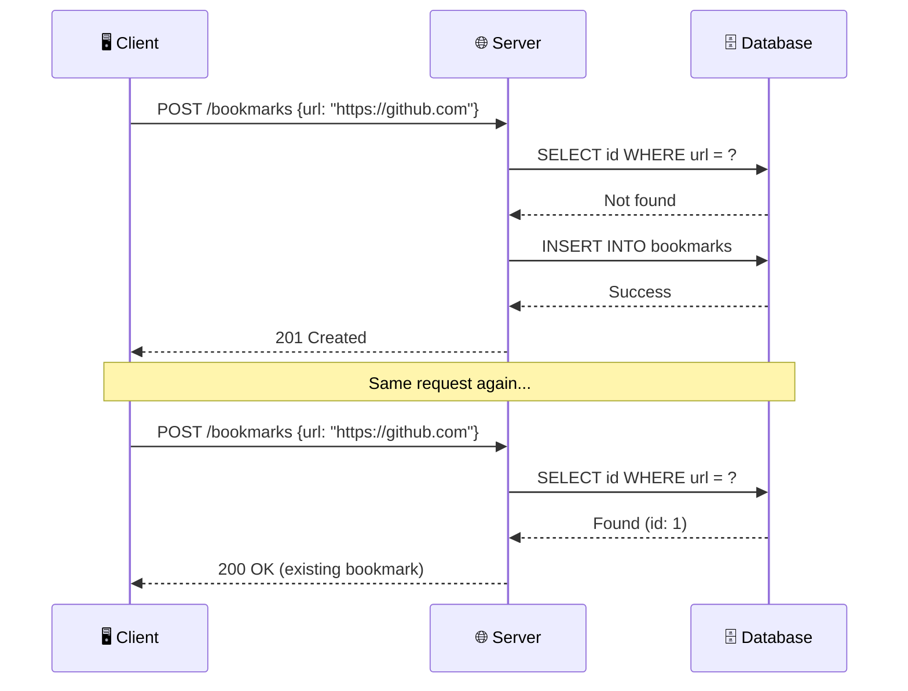
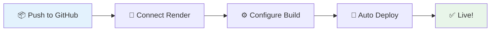

<div align="center">

# 🔖 Bookmark Service

**A production-ready HTTP API for saving bookmarks with validation at the boundary**


[](https://railway.app/template/xxx)
[](https://render.com/deploy)

</div>

---

## 📐 Architecture



## 🏗️ Project Structure

```
bookmark-service/
├── 📄 package.json          # Dependencies & scripts
├── 📄 README.md             # Documentation
├── 📄 .gitignore            # Git exclusions
└── 📁 src/
    ├── 📄 index.js           # Express server entry point
    ├── 📄 db.js              # SQLite database setup
    ├── 📁 middleware/
    │   └── 📄 validation.js  # Request validation logic
    └── 📁 routes/
        └── 📄 bookmarks.js   # Bookmark CRUD endpoints
```

## 🚀 Quick Start

### Prerequisites
- [Node.js](https://nodejs.org/) v18+ 
- npm (comes with Node)

### Local Development

```bash
# 1️⃣ Clone the repository
git clone https://github.com/your-username/bookmark-service.git
cd bookmark-service

# 2️⃣ Install dependencies
npm install

# 3️⃣ Start development server (with auto-reload)
npm run dev

# 4️⃣ Server runs at http://localhost:3000
```

### Production

```bash
npm start
```

## 📡 API Endpoints

| Method | Endpoint | Description | Status Codes |
|--------|----------|-------------|--------------|
| `POST` | `/bookmarks` | Create a bookmark | `201`, `200`, `400` |
| `GET` | `/bookmarks` | List all bookmarks | `200` |
| `GET` | `/bookmarks/:id` | Get bookmark by ID | `200`, `400`, `404` |
| `DELETE` | `/bookmarks/:id` | Delete a bookmark | `204`, `400`, `404` |
| `GET` | `/health` | Health check | `200` |

## 🧪 Testing the API

### Create a Bookmark
```bash
curl -X POST http://localhost:3000/bookmarks \
  -H "Content-Type: application/json" \
  -d '{
    "url": "https://github.com",
    "title": "GitHub",
    "description": "Where the world builds software"
  }'
```

**Response:**
```json
{
  "id": 1,
  "url": "https://github.com",
  "title": "GitHub",
  "description": "Where the world builds software"
}
```

### List All Bookmarks
```bash
curl http://localhost:3000/bookmarks
```

### Get Bookmark by ID
```bash
curl http://localhost:3000/bookmarks/1
```

### Delete a Bookmark
```bash
curl -X DELETE http://localhost:3000/bookmarks/1
```

## 🛡️ Validation System

### Design Principles



### Error Response Format

```json
{
  "error": "validation_failed",
  "fields": {
    "url": "must be a valid URL with http or https protocol",
    "title": "must be a string"
  }
}
```

### Validation Rules

| Field | Required | Type | Max Length | Validation |
|-------|----------|------|------------|------------|
| `url` | ✅ | string | 2048 | Valid HTTP/HTTPS URL |
| `title` | ❌ | string | 255 | — |
| `description` | ❌ | string | 1000 | — |

**Key Features:**
- ✅ Check shape before meaning
- ✅ Report ALL failures at once
- ✅ Name the field and rule in error
- ✅ Reject unknown fields
- ✅ Set bounds on all inputs

## 🔄 Duplicate Detection

### How It Works



### Why URL as Unique Identifier?

| Approach | Pros | Cons |
|----------|------|------|
| **URL (✅ Chosen)** | Natural identifier, semantically correct | Different titles for same URL ignored |
| Auto-increment ID | Simple | Duplicates allowed |
| UUID | Unique | Random, not meaningful |
| Title + URL combo | Allows same URL with different titles | Complex, still allows duplicates |

**Decision:** URL is the natural unique key. Two bookmarks pointing to the same URL are the same resource, regardless of title differences.

## 🚢 Deployment

### Render (Recommended)



**Steps:**
1. Push code to GitHub
2. Go to [render.com](https://render.com) → Sign in with GitHub
3. Click **New** → **Web Service**
4. Connect your repository
5. Configure:
   - **Name:** `bookmark-service`
   - **Runtime:** Node
   - **Build Command:** `npm install`
   - **Start Command:** `npm start`
6. Click **Create Web Service**

**Result:** `https://bookmark-service.onrender.com`

### Railway

```bash
npm i -g @railway/cli
railway login
railway init
railway up
```

## 📊 Tech Stack

| Component | Technology | Purpose |
|-----------|------------|---------|
| Runtime | Node.js v18+ | JavaScript execution |
| Framework | Express.js | HTTP routing |
| Database | SQLite | Persistent storage |
| Validation | Custom middleware | Input validation |

## 📝 Environment Variables

| Variable | Default | Description |
|----------|---------|-------------|
| `PORT` | `3000` | Server port |

## 🤝 Contributing

1. Fork the repository
2. Create your feature branch (`git checkout -b feature/amazing`)
3. Commit your changes (`git commit -m 'Add amazing feature'`)
4. Push to the branch (`git push origin feature/amazing`)
5. Open a Pull Request

## 📄 License

This project is licensed under the MIT License - see the [LICENSE](LICENSE) file for details.

---

<div align="center">

**Built with ❤️ using Node.js & Express**

[](https://github.com/your-username)

</div>
